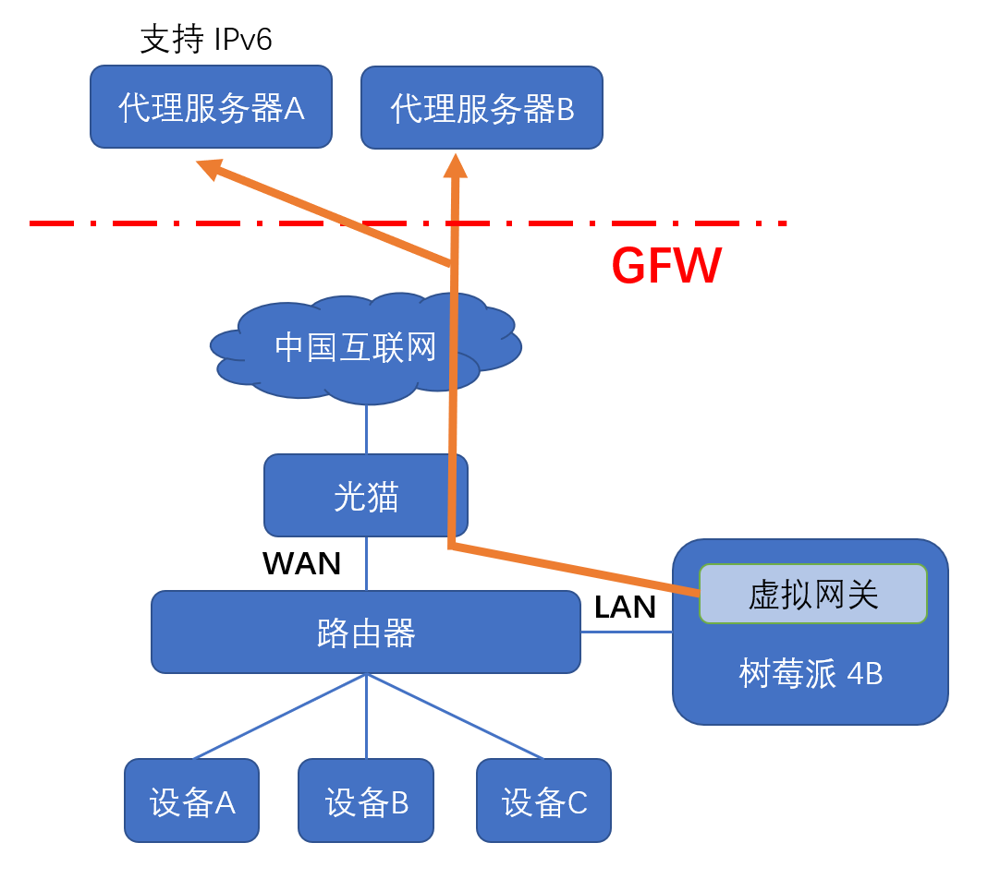

# 家庭网络的 IPv4 与 IPv6 透明代理

家庭网络光纤入网，支持 IPv4 与 IPv6 网络，需要在内网搭建透明代理，让设备的国内流量直连，出境流量转发到代理服务器上，避开 GFW 的流量审查。

以下为典型网络拓扑：



> 此处网络拓扑仅为讲解使用，实际使用时可以让光猫桥接减少性能浪费，不过目前大部分新版光猫不存在性能瓶颈，千兆级别下基本没有压力。

正常情况下，大部分家庭宽带为：光猫对接上游网络，使用宽带拨号获取运营商分配的 IPv4 地址与 IPv6 前缀，在 LAN 侧提供网络服务，其中 IPv4 为 NAT 方式，IPv6 发布 RA 广播，同时运行 DHCPv6 服务；路由器在 IPv4 上 NAT ，在 IPv6 上桥接，内网设备统一接入路由器。

大多数地区的运营商不会提供 IPv4 公网地址，IPv6 分配一般为 64 位长度的公网网段；虚拟网关在这里需要收集内网的所有 IPv4 与 IPv6 流量，将国内流量直接送出，国外流量发往代理服务器；为了增加难度，我们假设有两台境外代理服务器，一台支持IPv6，一台只支持IPv4，我们需要将IPv6代理流量发送给前者，其余代理流量送往后者。

## 分流规则

代理内核需要区分出哪些流量可以直连，哪些流量需要送往代理服务器，为了更准确地分流，这里需要开启嗅探功能，获取访问的域名信息，同时允许流量重定向（目标地址修改为域名，送至代理服务器解析，避开 DNS 污染）。

目前路由资源中包含了一份国内常见域名列表（即 `geosite.dat` ，XProxy 已集成），如果嗅探后的域名在其中，那可以直接判定为直连流量，但是对于其他流量，即使它不在列表内，但仍可能是国内服务，我们不能直接将它送往代理服务器；因此下一步我们需要引出分流的核心规则，它取决于 DNS 污染的一个特性：受污染的域名返回解析必然为境外 IP ，基于这个原则，我们将嗅探到的域名使用国内 DNS 进行一次解析，如果结果是国内 IP 地址，那就直连该流量，否则发往代理服务器，IPv4 与 IPv6 均使用该逻辑分流。

如果有可能的话，您可以在内网搭建一个无污染的解析服务，比如 [ClearDNS](https://github.com/dnomd343/ClearDNS)，它的作用在于消除 DNS 污染，准确地给出国内外的解析地址，这样子可以在分流时就不用多做一次 DNS 解析，减少这一步导致的延迟（DNS 流量通过代理送出，远程解析以后再返回，其耗时较长且不稳定），无污染 DNS 可以更快更准确地进行分流。

## 网络配置

网络地址方面，内网 IPv4 段由我们自己决定，这一部分取决于路由器设置的 LAN 侧 IP 段，我们假设为 `192.168.2.0/24` ，其中路由器地址为 `192.168.2.1` ，虚拟网关分配为 `192.168.2.2` ，由于 IPv4 部分由路由器 NAT 隔离，这里不需要修改光猫配置；虚拟网关上游配置为路由器地址，修改内网 DHCP 服务，让网关指向 `192.168.2.2` 。

IPv6部分，由于路由器桥接，地址分配等操作均为光猫负责，它拥有一个链路本地地址，在 LAN 侧向内网发送 RA 广播，一些光猫还会开启 DHCPv6 服务，为内网分配 DNS 等选项；RA 通告发布的 IPv6 前缀一般为运营商分配的 64 位长度地址，内网所有设备将获取到一个独立的 IPv6 地址（部分地区也有做 NAT6 的，具体取决于运营商），我们要做的就是将这部分工作转移给虚拟网关来完成。

在开始之前，我们需要先拿到光猫分配的 IPv6 前缀与网关（即光猫的链路地址），由于光猫默认会发布 RA 广播，你可以直接从当前接入设备上获取这些信息，也可以登录光猫管理页面查看（登录账号与密码一般会印在光猫背面）；这里假设运营商分配的 IPv6 网段为 `2409:8a55:e2a7:3a0::/64` ，光猫地址为 `fe80::1`（绝大多数光猫都使用这个链路地址），虚拟网关的上游应该配置为光猫链路地址，而自身地址可以在分配的 IPv6 网段中任意选择，方便起见，我们这里配置为 `2409:8a55:e2a7:3a0::` 。

虚拟网关需要对内网发布 RA 通告，广播 `2409:8a55:e2a7:3a0::/64` 这段地址，接收到这段信息的设备会将虚拟网关作为公网 IPv6 的下一跳地址（即网关链路地址）；但是这种情况下，不应该存在多个 RA 广播源同时运行，所以需要关闭光猫的 RA 广播功能，如果不需要 DHCPv6 功能，这里也可以一并关闭；这一步在部分光猫上需要超级管理员权限，一般情况下，你可以在网络上搜索到不同型号光猫的默认超级管理员账号密码，如果无法成功，可以联系宽带师傅帮忙登入。

三大运营商的光猫，超级管理员默认账号密码：

+ 移动 ：`CMCCAdmin` ，`aDm8H%MdA`

+ 电信 ：`telecomadmin` ，`nE7jA%5m`

+ 联通 ：`CUAdmin` ，`CUAdmin`

这是 IPv6 在代理方面的缺点，它将发送 RA 广播的链路地址直接视为路由网关，且该地址无法通过其他协议更改，我们没法像 DHCPv4 一样直接配置网关地址，这在透明代理时远没有 IPv4 方便，只能将 RA 广播源放在网关上。

## 启动服务

首先创建 macvlan 网络：

```bash
# 宿主机网卡假定为 eth0
$ ip link set eth0 promisc on
$ modprobe ip6table_filter
# IPv6网段后续由XProxy更改，这里可以随意指定
$ docker network create -d macvlan --subnet=fe80::/10 --ipv6 -o parent=eth0 macvlan
```

将配置文件保存在 `/etc/route` 目录下，使用以下命令开启 XProxy 服务：

```bash
docker run --restart always \
  --privileged --network macvlan -dt \
  --name route --hostname route \
  --volume /etc/route/:/xproxy/ \
  --volume /etc/timezone:/etc/timezone:ro \
  --volume /etc/localtime:/etc/localtime:ro \
  dnomd343/xproxy:latest
```

## 参数配置

在设计上，应该配置四个出口，分别为 IPv4 直连、IPv4 代理、IPv6 直连、IPv6 代理，这里创建 4 个对应的 socks5 接口 `direct4` 、`proxy4` 、`direct6` 、`proxy6` ，用于检测对应出口是否正常工作。

此外，我们需要判断 IP 与域名的地理信息，而该数据库一直变动，需要持续更新；由于该项目的 Github Action 配置为 UTC 22:00 触发，即 UTC8+ 的 06:00 ，所以这里配置为每天早上 06 点 05 分更新，延迟 5 分钟拉取当日的新版本路由资源。

修改 `xproxy.yml` ，写入以下配置：

```yaml
proxy:
  log: info
  socks:
    proxy4: 1094
    direct4: 1084
    proxy6: 1096
    direct6: 1086
  sniff:
    enable: true
    redirect: true

network:
  dev: eth0
  dns:
    - 192.168.2.1
  ipv4:
    gateway: 192.168.2.1
    address: 192.168.2.2/24
  ipv6:
    gateway: fe80::1
    address: 2409:8a55:e2a7:3a0::/64
  bypass:
    - 169.254.0.0/16
    - 224.0.0.0/3
    - fc00::/7
    - fe80::/10
    - ff00::/8

radvd:
  log: 3
  dev: eth0
  enable: true
  option:
    AdvSendAdvert: on
    AdvManagedFlag: off
    AdvOtherConfigFlag: off
  prefix:
    cidr: 2409:8a55:e2a7:3a0::/64

asset:
  update:
    cron: "0 5 6 * * *"
    proxy: "socks5://192.168.2.2:1094"  # 通过代理下载 Github 文件
    url:
      geoip.dat: "https://github.com/Loyalsoldier/v2ray-rules-dat/releases/latest/download/geoip.dat"
      geosite.dat: "https://github.com/Loyalsoldier/v2ray-rules-dat/releases/latest/download/geosite.dat"
```

## 代理配置

配置出站代理，修改 `config/outbounds.json` 文件，其中 direct 直连到国内网络，proxy 填入代理服务器参数：

```json
{
  "outbounds": [
    {
      "tag": "direct4",
      "protocol": "freedom",
      "settings": {
        "domainStrategy": "UseIPv4"
      }
    },
    {
      "tag": "direct6",
      "protocol": "freedom",
      "settings": {
        "domainStrategy": "UseIPv6"
      }
    },
    {
      "tag": "proxy4",
      "...": "..."
    },
    {
      "tag": "proxy6",
      "...": "..."
    }
  ]
}
```

接着配置路由部分，让暴露的 4 个 socks5 接口对接上，并依据上文的分流方式编写路由规则；创建 `config/routing.json` 文件，写入以下配置：

```json
{
  "routing": {
    "domainStrategy": "IPOnDemand",
    "rules": [
      {
        "type": "field",
        "inboundTag": ["direct4"],
        "outboundTag": "direct4"
      },
      {
        "type": "field",
        "inboundTag": ["direct6"],
        "outboundTag": "direct6"
      },
      {
        "type": "field",
        "inboundTag": ["proxy4"],
        "outboundTag": "proxy4"
      },
      {
        "type": "field",
        "inboundTag": ["proxy6"],
        "outboundTag": "proxy6"
      },
      {
        "type": "field",
        "inboundTag": ["tproxy4"],
        "domain": ["geosite:cn"],
        "outboundTag": "direct4"
      },
      {
        "type": "field",
        "inboundTag": ["tproxy6"],
        "domain": ["geosite:cn"],
        "outboundTag": "direct6"
      },
      {
        "type": "field",
        "inboundTag": ["tproxy4"],
        "ip": [
          "geoip:cn",
          "geoip:private"
        ],
        "outboundTag": "direct4"
      },
      {
        "type": "field",
        "inboundTag": ["tproxy6"],
        "ip": [
          "geoip:cn",
          "geoip:private"
        ],
        "outboundTag": "direct6"
      },
      {
        "type": "field",
        "inboundTag": ["tproxy4"],
        "outboundTag": "proxy4"
      },
      {
        "type": "field",
        "inboundTag": ["tproxy6"],
        "outboundTag": "proxy6"
      }
    ]
  }
}
```

重启 XProxy 容器使配置生效：

```bash
docker restart route
```

最后，验证代理服务是否正常工作，若出现问题可以查看 `/etc/route/log` 文件夹下的日志，定位错误原因。
